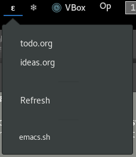
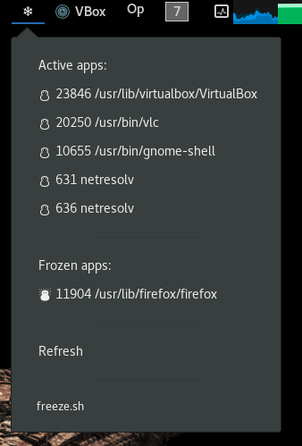
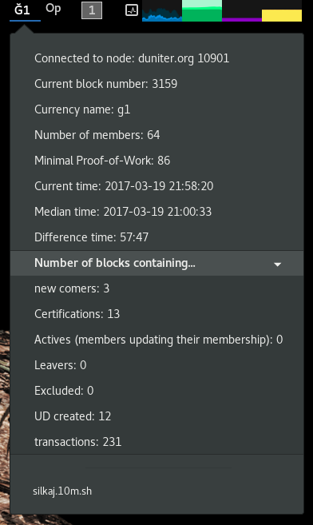
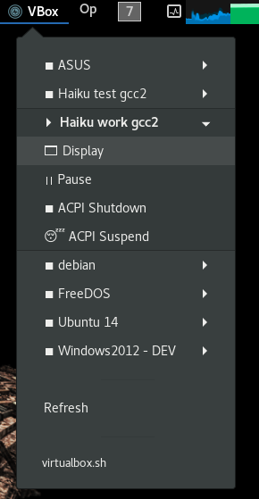

# My Argos Scripts 

Some scripts for the [Argos](https://github.com/p-e-w/argos) Gnome-Shell extension, or [KArgos](https://github.com/lipido/kargos) on KDE, or BitBar on MacOS.
Hopefully someday for Haiku as well.

# Emacs Buffers: emacs.sh

Lists the buffers in running Emacs (you need to have Emacs-Server enabled) and goes right to the selected one.

# Freeze processes: freeze.sh

Lists the top processes and allows freezing them, and unfreezing as well.

This helps when, say, Firefox eats up too much RAM and you want to leave it swapped out when working on something else.

# Silkaj: silkaj.10m.sh

Silkaj is a python command line client for the DUniter blockchain-based P2P Fair Money system.

I added an "argos" command to Silkaj, so this script just runs it with the command as argument.

# VirtualBox VMs: virtualbox.sh

Lists the VirtualBox virtual machines, and allows changing their state.

